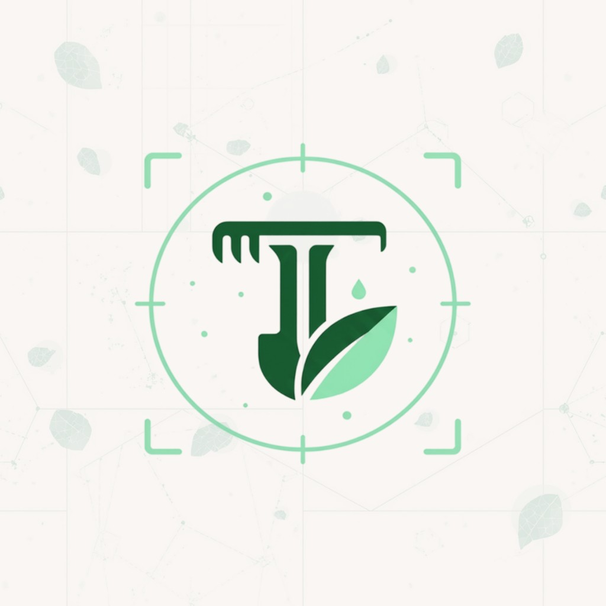
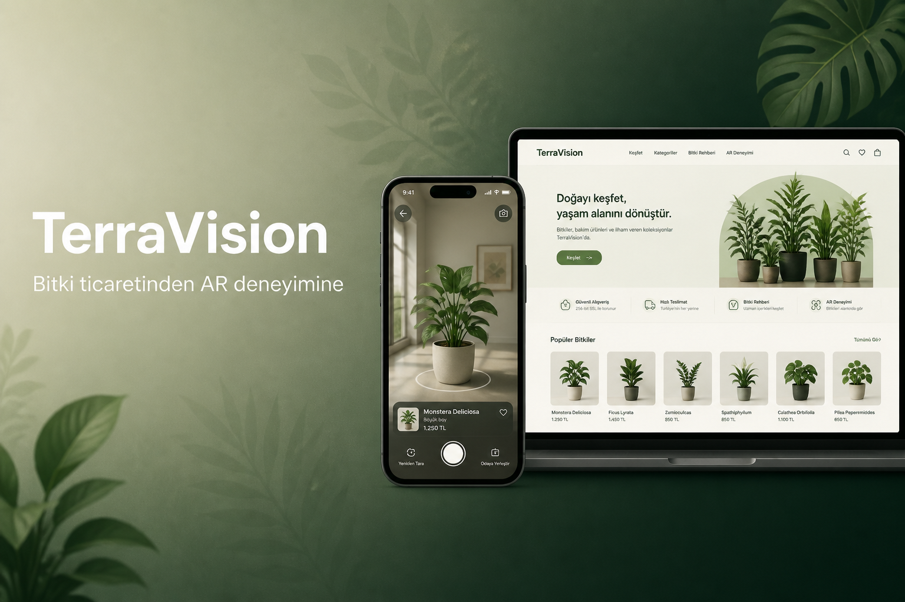
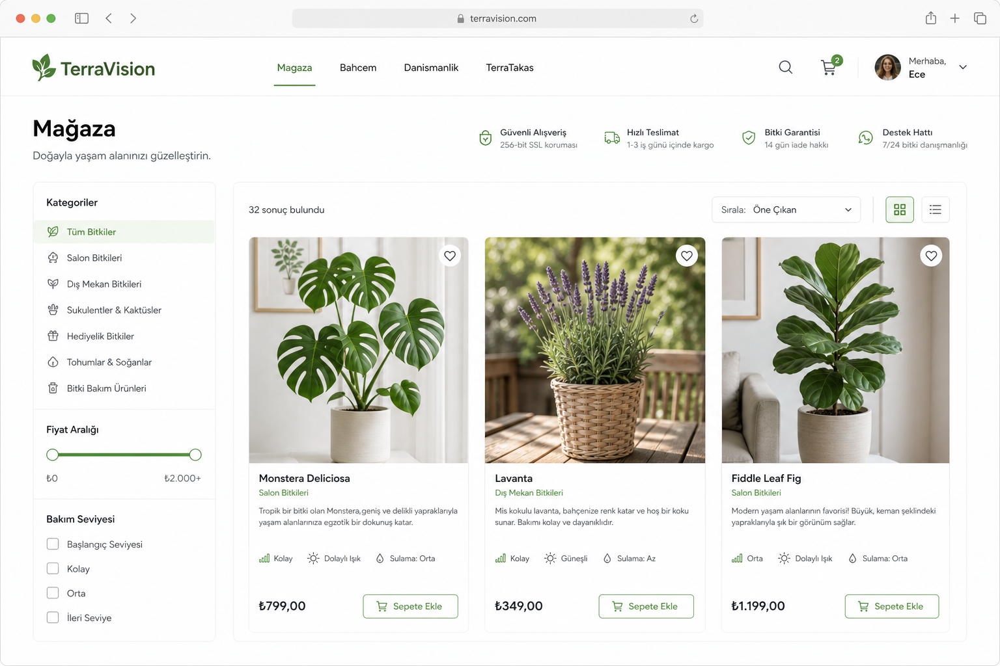
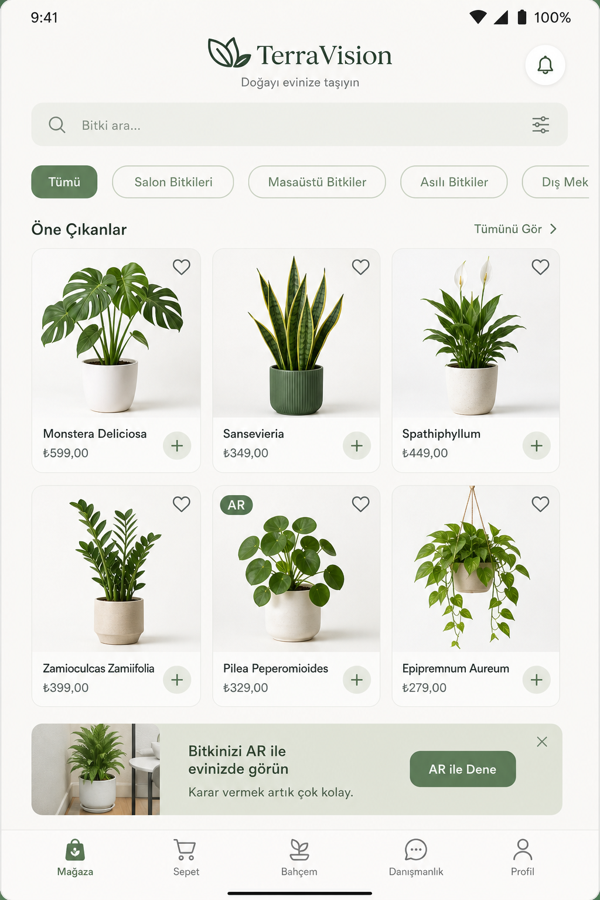
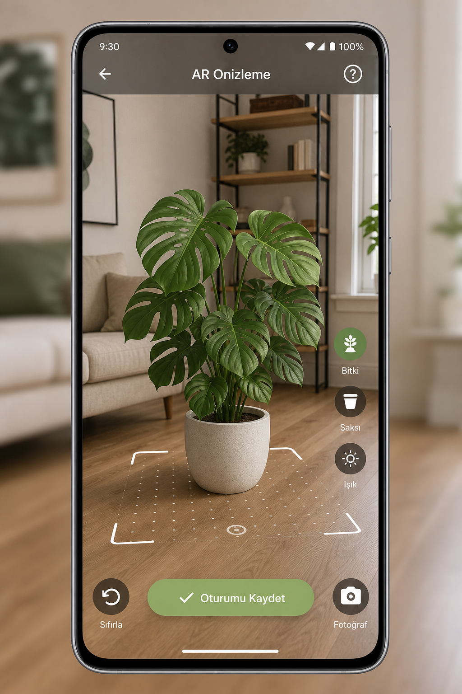
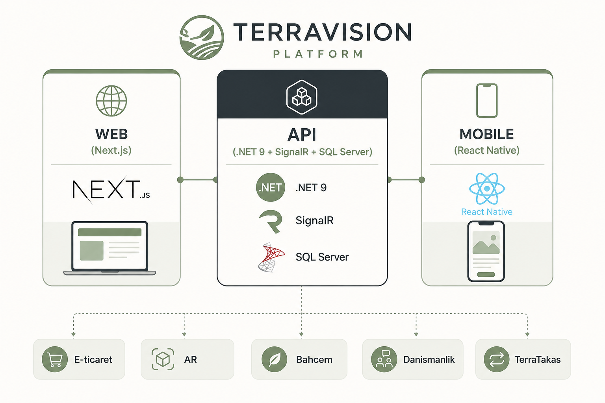

<p align="center">
  
</p>

<h1 align="center">TerraVision</h1>

<p align="center">
  <strong>Bitki ticaretinden artırılmış gerçekliğe</strong><br />
  E-ticaret · AR · Bahçe bakımı · Danışmanlık · TerraTakas
</p>

<p align="center">
  
  
  
  
  
</p>



## Özet

**TerraVision**, bitki ve bahçe ekosistemini tek platformda birleştiren full-stack bir uygulamadır. Kullanıcılar mağazadan ürün satın alır, ürünleri **AR** ile mekânda önizler, kişisel bahçe bakım takvimini yönetir, peyzaj danışmanlarıyla randevu ve sohbet kurar ve **TerraTakas** üzerinden ürün takası yapar.

Aynı API üzerinde çalışan **web** (Next.js) ve **mobil** (React Native) istemciler, paylaşılan sözleşme katmanı (`@terravision/shared`) ve **SignalR** ile canlı sepet, sipariş, bildirim ve sohbet güncellemeleri alır.

## Ekran Görüntüleri

| Web mağaza | Mobil mağaza | Mobil AR |
|:---:|:---:|:---:|
|  |  |  |

> Görseller ürün deneyimini temsil eden arayüz mockup’larıdır. Canlı ortamda marka varlıkları `clients/*/…/brand/` altında yer alır.

## Özellikler

| Modül | Açıklama |
| --- | --- |
| **E-ticaret** | Katalog, kampanyalar, sepet, ödeme, sipariş takibi |
| **AR** | 3D model önizleme, oturum kaydı, admin model yükleme |
| **Bahçem** | Kişisel bitki takvimi, bakım aksiyonları, bakım asistanı |
| **Danışmanlık** | Randevu yönetimi, gerçek zamanlı sohbet, teklifler |
| **TerraTakas** | Kullanıcılar arası ürün listeleme ve takas teklifleri |
| **Admin** | Sipariş / ürün / kullanıcı / kampanya / AR içgörüleri |
| **Realtime** | Sepet, sipariş, stok, bildirim ve sohbet olayları (SignalR) |

## Mimari



```
TerraVision.Api/                 ASP.NET Core 9 API + SignalR + EF Core
├── Controllers / Services / Hubs
├── clients/
│   ├── web-nextjs/              Next.js 15 web istemcisi
│   ├── mobile-react-native/     React Native 0.85 mobil istemci
│   └── shared/                  Ortak DTO, HTTP ve realtime yardımcıları
├── TerraVision.Api.Tests/       Backend testleri
├── docs/                        Kurulum ve operasyon notları
└── .github/workflows/ci.yml     Backend · Web · Mobile CI
```

| Katman | Teknoloji |
| --- | --- |
| API | ASP.NET Core 9, EF Core, SQL Server, JWT, FluentValidation, SignalR |
| Web | Next.js 15, React 19, TypeScript, Axios |
| Mobil | React Native 0.85, React Query, AsyncStorage, native AR bridge |
| Ortak | `@terravision/shared` (sözleşmeler + istemci yardımcıları) |
| Medya | Yerel `wwwroot` veya S3/MinIO (`docker-compose`) |

## Hızlı başlangıç

### 1) API

```bash
dotnet run --launch-profile http
# → http://localhost:5090
```

SQL Server bağlantısı `appsettings.json` içindedir. Üretim ayarları için [docs/production-config.md](docs/production-config.md).

### 2) Web

```bash
cd clients/web-nextjs
npm install
cp .env.local.example .env.local   # Windows: copy .env.local.example .env.local
npm run dev
# → http://localhost:3000
```

### 3) Mobil

```bash
cd clients/mobile-react-native
npm install
npm run setup:device               # fiziksel cihaz (opsiyonel)
npm start                          # Metro :8082
npm run android                    # veya npm run android:win
```

Ayrıntılar: [docs/mobil-fiziksel-cihaz.md](docs/mobil-fiziksel-cihaz.md)

### Demo hesaplar

| Rol | E-posta | Şifre |
| --- | --- | --- |
| Müşteri | `customer@terravision.com` | `customer123` |
| Danışman | `consultant@terravision.com` | `consultant123` |
| Admin | `admin@terravision.com` | `admin123` |

## Kalite kapısı

```bash
# Backend
dotnet test TerraVision.Api.Tests/TerraVision.Api.Tests.csproj -c Release

# Web
cd clients/web-nextjs && npm run build

# Mobil
cd clients/mobile-react-native && npm run release:check
```

CI: `.github/workflows/ci.yml` — `backend`, `web`, `mobile` işleri paralel çalışır.

## Dokümantasyon

| Belge | Konu |
| --- | --- |
| [docs/production-config.md](docs/production-config.md) | Üretim yapılandırması |
| [docs/mobil-fiziksel-cihaz.md](docs/mobil-fiziksel-cihaz.md) | Fiziksel cihazda mobil |
| [docs/mobil-ar-rehberi.md](docs/mobil-ar-rehberi.md) | AR akışı |
| [clients/web-nextjs/README.md](clients/web-nextjs/README.md) | Web istemci notları |
| [clients/mobile-react-native/README.md](clients/mobile-react-native/README.md) | Mobil istemci notları |

## Lisans

Bu depo özel bir proje çalışmasıdır. Tüm hakları saklıdır.
