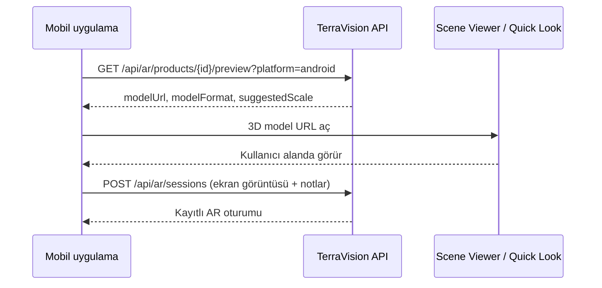

# Mobil AR rehberi

TerraVision mobil uygulamasında AR (artırılmış gerçeklik) bitki önizlemesi ve AR Odalarım özelliği.

## Uygulamada nerede?

Giriş yaptıktan sonra alt menüde **AR** sekmesi:

1. **Nasıl çalışır?** — kısa adımlar
2. **AR uyumlu ürünler** — 3D modeli olan bitkiler
3. **AR Odalarım** — kaydettiğiniz yerleşimler

Demo giriş: `customer@terravision.com` / `customer123`

---

## Çalışma mantığı



| Adım | Ne olur |
|------|---------|
| 1 | Müşteri AR sekmesinden ürün seçer |
| 2 | Uygulama API’den `ArPreviewResponse` alır (`modelUrl`, format, ölçek) |
| 3 | **Android:** Google Scene Viewer ile `.gltf` / `.glb` açılır |
| 4 | **iOS:** Quick Look ile `.usdz` açılır |
| 5 | İsteğe bağlı: ekran görüntüsü + not → **AR Odalarım** |

**Önemli:** AR önizleme API’si giriş gerektirir (`[Authorize]`). Misafir kullanıcı AR başlatamaz.

**Geliştirme ortamı:** Telefon USB ile bağlıyken `npm run setup:device` → `adb reverse` ile API (`5090`) ve Metro (`8082`) PC’ye yönlendirilir. Model dosyaları `http://localhost:5090/assets/ar-models/...` üzerinden servis edilir.

**Üretim:** AR modelleri internetten erişilebilir **HTTPS** URL olmalıdır (`MediaStorage:PublicBaseUrl`).

---

## AR uyumlu ürün nasıl eklenir?

Bir ürünün mobilde AR sekmesinde görünmesi için **iki alan** gerekir:

| Alan | Açıklama |
|------|----------|
| `IsArCompatible` | `true` — AR önizleme açık |
| `ArModelFileName` | `wwwroot/assets/ar-models/` altındaki dosya adı (ör. `PLT-MON-001.gltf`) |

### Yöntem 1 — Admin: 3D model yükle (önerilen)

1. Web admin veya mobil **Admin AR Model Upload** panelinden ürün seçin
2. `.gltf`, `.glb` veya `.usdz` dosyası yükleyin (max 25 MB)
3. Endpoint: `POST /api/media/ar-models?productId={id}`

Yükleme sonrası API otomatik olarak:

- `ArModelFileName` = üretilen dosya adı
- `IsArCompatible` = `true`

### Yöntem 2 — Web admin ürün formu

`/admin/products/new` sayfasında **AR uyumlu ürün** kutusunu işaretleyin. Bu yalnızca bayrağı açar; **model yüklemeden** AR çalışmaz. Sonra Yöntem 1 ile model ekleyin.

### Yöntem 3 — API ile güncelleme

```http
PUT /api/products/{id}
Content-Type: application/json

{
  "isArCompatible": true,
  "arModelFileName": "PLT-MON-001.gltf"
}
```

Model dosyasının fiziksel olarak `wwwroot/assets/ar-models/` (Local storage) veya S3 `ar-models/` prefix’inde bulunması gerekir.

### SKU yedek kuralı

`ArModelFileName` boşsa API şu yolu dener:

```
/assets/ar-models/{SKU}.gltf   (Android)
/assets/ar-models/{SKU}.usdz   (iOS)
```

Örnek: SKU `PLT-MON-001` → `PLT-MON-001.gltf`

---

## Demo seed ürünleri

| Ürün | AR | Model dosyası |
|------|----|----------------|
| Monstera Deliciosa | Evet | `temp-smoke-eb98662c3ab549debb9e40237494adc3.gltf` |
| Fiddle Leaf Fig | Evet | `PLT-MON-001.gltf` (demo) |
| Lavanta Saksısı | Evet | `PLT-MON-001.gltf` (demo) |

Model dosyaları: `wwwroot/assets/ar-models/`

Migration uygulandıktan sonra API’yi yeniden başlatın; mobilde ürün listesini yenileyin (uygulamayı kapat-aç veya profilden çık-gir).

---

## Sık sorunlar

| Belirti | Çözüm |
|--------|--------|
| AR sekmesi boş | Üründe `IsArCompatible` + model dosyası var mı? |
| 404 AR modeli | `ArModelFileName` doğru mu? Dosya `assets/ar-models/` altında mı? |
| 503 AR modeli | Dev: API çalışıyor mu? `setup:device` + `adb reverse` |
| Giriş isteniyor | Müşteri hesabıyla giriş yapın |
| Scene Viewer açılmıyor | Google Play Services / ARCore güncel mi? |

---

## İlgili dosyalar

- Mobil AR sekmesi: `clients/mobile-react-native/src/features/ar/ArSection.tsx`
- API: `Controllers/ArController.cs`, `Controllers/MediaController.cs`
- Modeller: `wwwroot/assets/ar-models/`
- Seed: `Data/SeedData.cs`
